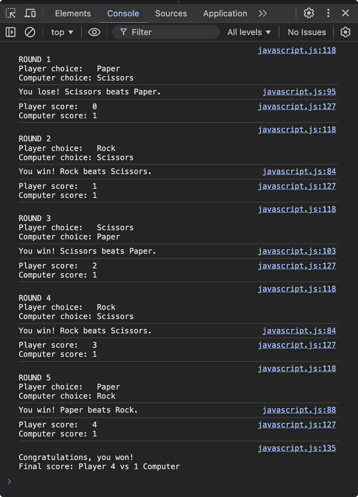

# Rock Paper Scissors

## This is a javascript exercise from the web development course The Odin Project.

The game is played enterily in the browser console.

Concepts applied to this exercise:
- Template strings (template literals)
- Functions
- Loops
- Comparison
- Operations

 
